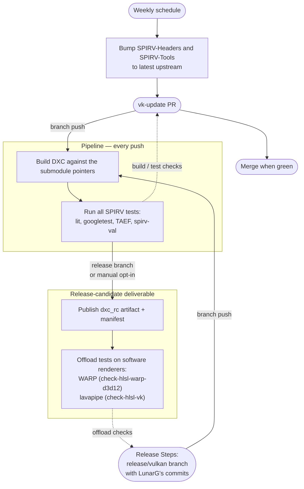

* Impacted Projects: DXC

## Introduction

DXC is included in the Vulkan SDK. Before each SDK release, the DXC submodule
references (SPIRV-Headers, SPIRV-Tools) need to be updated and the product needs
to be tested. This process has previously been mostly performed manually. This
document details the requirements for ensuring DXC is ready for inclusion in the
Vulkan SDK and proposes the changes required in order to satisfy them.

## Motivation

SPIRV-Headers and SPIRV-Tools need to be kept up to date so that the most recent
SPIRV features are available in DXC. We need to verify that DXC is generating
valid SPIRV code and that there are no regressions. The process needs to be
documented and automated enough so that it does not rely on individuals with
special knowledge. Additionally, we want to align the version included in the
Vulkan SDK with a formal DXC release so that it matches up with GitHub and NuGet
releases and can be ingested into Godbolt.

## Proposed solution

The SPIRV-Headers and SPIRV-Tools submodule pointers are the single source of truth
for which SPIRV revisions a candidate is built against; there is no separate pin
file. A single pipeline serves the whole process through three triggers. On a weekly
schedule it advances the submodules to the latest upstream commit and opens a pull
request on a `vk-update/<date>` branch; pushing that branch builds and tests DXC,
and the results surface on the pull request, so the bump is merged only once it is
green. When an SDK release is being prepared, the same pipeline runs against a
`release/vulkan/<version>` branch and additionally publishes the candidate as a
build artifact and runs the LLVM offload-test-suite against it on software renderers
— WARP for D3D12 and lavapipe for Vulkan — so its shaders are actually executed
without a physical GPU. The pipeline can also be started manually. The SDK builders
do not consume the artifact; they are given the candidate's DXC commit, which the
manifest records.



### Weekly dependency update

A scheduled job runs once a week. It advances the SPIRV-Headers and SPIRV-Tools
submodules to their latest upstream commit and, if anything changed, commits the
new pointers onto a fresh `vk-update/<date>` branch and opens a pull request.
Pushing that branch builds and tests DXC, and the results surface on the pull
request, so the bump is merged only once it is green. Keeping DXC current against
upstream SPIRV needs no manual step.

### Pipeline

The pipeline runs on every push to a `vk-update/<date>` branch (the weekly job
creates these) or a `release/vulkan/<version>` branch (cut by hand for a release;
see Release Steps), and can be started manually from the GitHub UI. The build and
test stages always run; the publish and offload stages run only for a release
candidate — a `release/vulkan/<version>` branch, or a manual run that opts in.

1. **Build.** DXC is checked out with its submodules, so it builds against exactly
   the SPIRV the pointers name, and configured with SPIRV code generation and the
   SPIRV tests enabled. It also builds the tools the tests depend on, such as
   `spirv-val`.

2. **Test.** All of the SPIRV tests available in the DXC repo are run in this
   stage: the lit tests, the googletest unit tests, and the TAEF tests. The
   generated code is also validated with `spirv-val`. This stage is non-blocking: a
   release candidate is published even if some tests fail.

3. **Publish.** The DXC binary, a machine-readable manifest, and the per-tool test
   reports are published as a single artifact, named `dxc_rc_<version>`.

4. **Offload tests.** A job runs the LLVM offload-test-suite against the candidate.
   It clones the suite, builds it against the candidate's DXC binary, and runs its
   tests on software renderers rather than physical GPUs: WARP for the D3D12 path
   (`check-hlsl-warp-d3d12`) and lavapipe, Mesa's software Vulkan implementation,
   for the Vulkan path (`check-hlsl-vk`). This actually executes the shaders the
   candidate compiles, so the candidate is exercised end to end on a hosted runner
   with no GPU hardware.

### Release manifest

The manifest records the DXC commit, the SPIRV-Headers and SPIRV-Tools commits the
candidate was built against, the per-tool results, and a single `validated` flag
that is true only when every tool passed:

```json
{
  "dxc_commit": "<sha>",
  "spirv_dependencies": {
    "SPIRV-Headers": "<sha>",
    "SPIRV-Tools": "<sha>"
  },
  "test_suites": [
    { "name": "spirv-unit", "passed": 105, "failed": 0 },
    { "name": "spirv-codegen", "passed": 1564, "failed": 0 },
    { "name": "spirv-taef", "passed": 1, "failed": 0 },
    { "name": "spirv-val", "passed": 6, "failed": 0 }
  ],
  "validated": true
}
```

### Release Steps

These steps are performed by whoever is currently responsible for monitoring the
llvm-build, and may be repeated as needed:

1. Update the SPIRV-Headers and SPIRV-Tools submodules to the commits specified by
   LunarG.
2. Create the `release/vulkan/<version>` branch, which triggers the pipeline.
3. Check whether the resulting candidate is validated (see
   [Release Candidate readiness](#release-candidate-readiness)).
4. Report the validated DXC commit to LunarG.

### Release Candidate readiness

The following must be true and validated for a release candidate to be considered
ready for the Vulkan SDK.

* It builds against the SPIRV-Headers and SPIRV-Tools commits the submodules are
  pinned to.
* Every SPIRV testing tool passes, and the SPIRV the binary emits validates under
  `spirv-val`.
* The shaders the candidate compiles execute on the offload-test-suite under both
  software renderers (WARP for D3D12 and lavapipe for Vulkan).
* The manifest records the result, with `validated` set to `true`.
